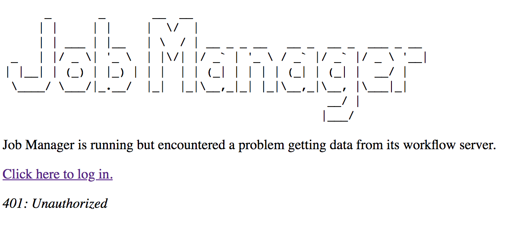

# Debugging Cromwell / CromIAM Deployments

## Shim requires oauth but UI doesn't log you in

#### Symptoms

The UI is making unauthenticated requests to the shim layer, but the shim is
rejecting them as unauthorized.

In the UI, Job Manager prompts you to log in but cannot proceed past this page:

---



---


In the javascript console you see messages like: `ERROR Error: Uncaught (in promise): Object: {"status":401,"title":"Unauthorized","message":"User not authorized to access this resource."}`

#### Cause

You've set up the Cromwell shim's `docker-compose.yml` to include the following:

```yaml
services:
  cromwell:
    environment:
      - USE_CAAS=True
```

Or, perhaps you've set the environment variable `USE_CAAS=True` manually.

**But**: you haven't told the UI to log users in.

#### Resolution

Add an `authentication` section to the end of the Cromwell shim's `capabilities.conf`. When the UI
reads this, it then knows how to direct users to the oauth login.

```json
{
  ...,
  
  "authentication": {
    "isRequired": true,
    "scopes": [
      "openid",
      "email",
      "profile"
    ]
  }
}
```

## Unable to connect to Cromwell URL

#### Symptoms

The UI asks me to log in but when I do, I just get redirected back to the 
same`Authenticate` page.
 
In the Cromwell Shim logs, I see a long stack trace starting with:

```
cromwell_1         | ERROR:flask.app:Exception on /api/v1/jobs/query [POST]
cromwell_1         | Traceback (most recent call last):
cromwell_1         |   File "/usr/local/lib/python2.7/dist-packages/flask/app.py", line 2292, in wsgi_app
cromwell_1         |     response = self.full_dispatch_request()
```

Followed by an error message like this (with your Cromwell URL replacing `https://some/host`):

```
ConnectionError: HTTPConnectionPool(host='https://some/host', port=8000): Max retries exceeded with url: /api/workflows/v1/query (Caused by NewConnectionError('<urllib3.connection.HTTPConnection object at 0x7f32d1908510>: Failed to establish a new connection: [Errno 111] Connection refused',))
```

#### Cause

The Cromwell Shim is unable to make a connection to the CromIAM service. 

#### Resolution

There are a few things to check here:

- Is the URL correct?
    - If not - change the `CROMWELL_URL` environment variable - either manually on the command line or in `docker-compose.yaml`
    - Don't forget to format it appropriately, eg `export CROMWELL_URL=https://<<hostname>>/api/workflows/v1`
- Is the network link between shim and CromIAM available?
    - If not, resolve the issue before restarting Job Manager
- Is the CromIAM service actually running?
    - If not, resolve the issue before restarting Job Manager


