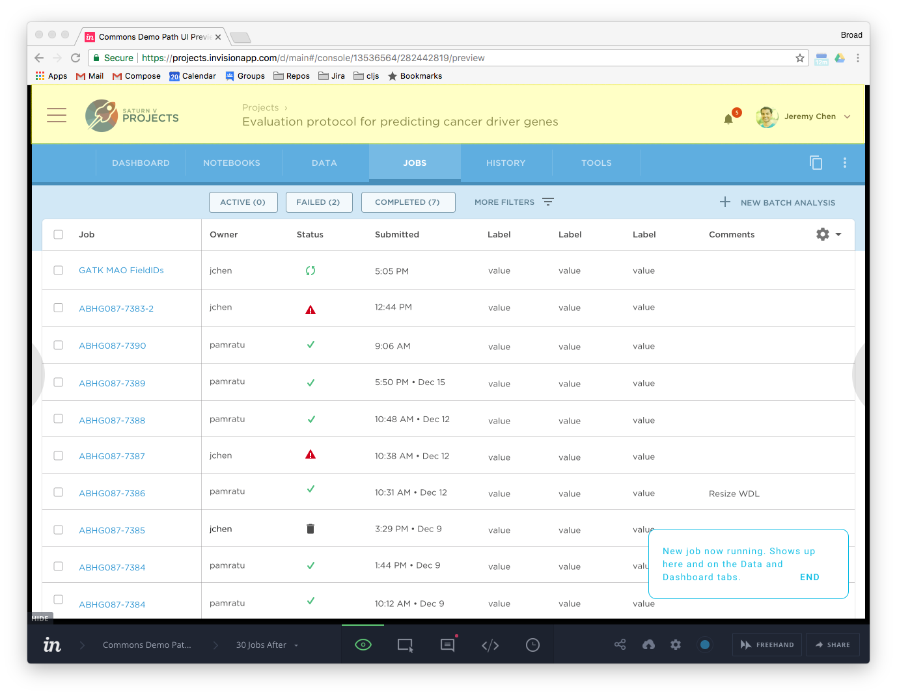

# Shared Header (a.k.a. "Chrome")
-David Mohs

The following UI design represents Job Manager within the context of Saturn and the Data Biosphere:

The highlighted portion represents a common header shared by Saturn and Job Manager. This header carries navigation to other Data Biosphere tools, contextual information (e.g., the current project), and user information. There a a few implementation options differing mainly in the amount of cross-project coordination required. To the extent possible, we should strive to minimize this, since it increases both the complexity and communication overhead.

I recommend that Saturn and Job Manager implement the header as designed without sharing code. I have several reasons for this recommendation. Regardless of the technical approach, implementation effort is required from each team.

If we were to share a library that contains the header as a widget, at least one team would have to put in substantial effort to create this library, and each team would then need to put in some effort to integrate the library into their UI. Despite the small surface area of the header, it would likely represent a substantial portion of the download size experienced by a user, since the technical choices made by different UI teams tend to have many non-intersecting dependencies.

Another option is to share the entire Job Manager UI as a library that may be consumed by Saturn. This would likely be less effort than creating the shared header, but carries the same drawbacks as the shared library approach above.

We could alleviate the "download size" problem by re-writing Job Manager in a stack identical to that used by Saturn. While we may wish to do this in the future, sharing this header is not a strong-enough reason for doing this now.

The common header area is relatively small and should not demand a large implementation effort, likely no more than a few days for a developer with experience in the project's technologies.

The main drawback to the recommended approach is the hazard that the separate implementations will cause the header's visual style to vary between projects. I do not believe this is cause for concern. A bit of variation, while not ideal, shouldn't be detrimental to our users' experience. If this turns out to be something we'd like to tackle in the future, we can do so without changing our approach.
